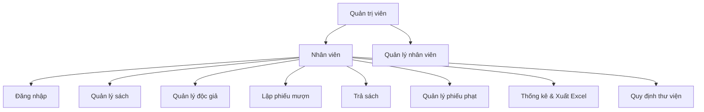
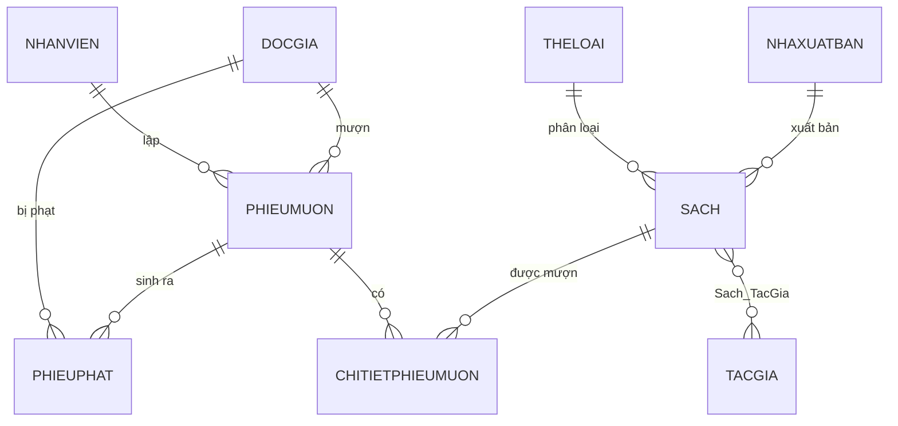
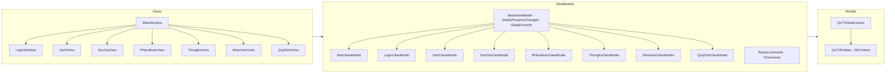

# BÁO CÁO ĐỒ ÁN — QUẢN LÝ THƯ VIỆN (QLTV)

## 1. Giới thiệu

- **Tên đồ án:** Hệ thống quản lý thư viện
- **Công nghệ:** C# / WPF (.NET Framework 4.8), mô hình MVVM, Entity Framework 6 (Database First), SQL Server
- **Chức năng chính:**
  - Đăng nhập nhân viên (mật khẩu mã hóa SHA256)
  - Quản lý sách, độc giả, nhân viên (thêm / sửa / xóa / tìm kiếm)
  - Lập phiếu mượn, trả sách, tự động tính phạt quá hạn
  - Thống kê, xuất Excel, quản lý quy định thư viện

## 2. Môi trường và cách cài đặt

| Thành phần | Yêu cầu |
|---|---|
| Hệ điều hành | Windows 10/11 |
| .NET Framework | 4.8 |
| Visual Studio | 2019 trở lên |
| SQL Server | 2012 trở lên (bài viết dùng `LAPTOP-3GHGKLM7\SQLEXPRESS`) |
| NuGet packages | EntityFramework 6.5.1, EPPlus 4.5.3.3 |

**Các bước chạy:**
1. Chạy toàn bộ script `Database\QLTV.sql` trong SQL Server Management Studio để tạo DB `QLTV` (kèm dữ liệu mẫu).
2. Mở solution `QLTV.slnx` bằng Visual Studio.
3. Sửa chuỗi kết nối trong `QLTV\App.config` (`data source=...` cho đúng tên server của máy).
4. F5. Đăng nhập: `admin` / `123456`.

## 3. Phân tích hệ thống

### 3.1. Tác nhân (Actor)

| Actor | Vai trò |
|---|---|
| Thủ thư / Nhân viên | Đăng nhập, quản lý sách, độc giả, lập phiếu mượn/trả, thu phạt |
| Quản trị viên | Toàn quyền nhân viên: thêm/sửa/xóa tài khoản, chỉnh quy định |

### 3.2. Sơ đồ use case (Mermaid)



### 3.3. Mô hình hóa thực thể (ERD)



### 3.4. Mô tả các bảng (Database `QLTV`)

| Bảng | Mô tả | Khóa chính | Ghi chú |
|---|---|---|---|
| `NhanVien` | Nhân viên thư viện | `MaNhanVien` | `TaiKhoan` unique, `MatKhau` lưu SHA256 |
| `TheLoai` | Thể loại sách | `MaTheLoai` | |
| `NhaXuatBan` | Nhà xuất bản | `MaNXB` | |
| `TacGia` | Tác giả | `MaTacGia` | |
| `Sach` | Sách | `MaSach` | FK `MaTheLoai`, `MaNXB`; `SoLuong`/`SoLuongCon` |
| `Sach_TacGia` | Quan hệ N-N sách–tác giả | (`MaSach`,`MaTacGia`) | |
| `DocGia` | Độc giả | `MaDocGia` | `NgayHetHan`, `TrangThai` |
| `PhieuMuon` | Phiếu mượn | `MaPhieuMuon` | FK `MaDocGia`, `MaNhanVien`; `NgayHenTra` |
| `ChiTietPhieuMuon` | Từng cuốn sách của phiếu | (`MaPhieuMuon`,`MaSach`) | `NgayTra` NULL = chưa trả; `TrangThai` 0/1 |
| `PhieuPhat` | Phiếu phạt quá hạn | `MaPhieuPhat` | `TrangThai` 0 chưa thu / 1 đã thu |
| `QuyDinh` | Quy định thư viện | `MaQuyDinh` | Số sách tối đa, hạn mượn, tiền phạt |

### 3.5. Sơ đồ lớp kiến trúc MVVM



**Giải thích các lớp nền tảng:**
- `BaseViewModel`: triển khai `INotifyPropertyChanged` (cập nhật UI), `IDataErrorInfo` (validation), `ErrorSummary`/`GetValidationSummary` (tổng hợp lỗi).
- `RelayCommand`: triển khai `ICommand` để binding nút bấm vào phương thức.
- `QLTVEntities`: DbContext sinh tự động từ file `.edmx` (EF6 Database First) — **không sửa tay**, khi thay đổi CSDL dùng "Update Model from Database".

## 4. Thiết kế giao diện

| Màn hình | Mô tả |
|---|---|
| `LoginWindow` | Đăng nhập, thông báo lỗi, nhấn Enter để đăng nhập |
| `MainWindow` | Sidebar menu xanh + vùng nội dung chuyển theo tab (DataTemplate) |
| `SachView` | DataGrid sách, ô tìm kiếm, form thêm/sửa (ẩn/hiện) |
| `DocGiaView` | CRUD độc giả, kiểm tra hạn thẻ |
| `PhieuMuonView` | 3 tab: Lập phiếu mượn / Trả sách / Lịch sử phiếu mượn |
| `ThongKeView` | 4 bảng thống kê + nút Xuất Excel (EPPlus) |
| `NhanVienView` | CRUD nhân viên (mật khẩu tự mã hóa) |
| `QuyDinhView` | Sửa quy định trực tiếp, quản lý thu tiền phạt |

## 5. Nghiệp vụ quan trọng

### 5.1. Quy trình mượn sách
1. Chọn độc giả → kiểm tra: thẻ còn hiệu lực? chưa hết hạn?
2. Chọn sách → kiểm tra: còn đủ `SoLuongCon`? tổng sách đang mượn + mới ≤ quy định tối đa?
3. Lưu `PhieuMuon` + các `ChiTietPhieuMuon`, **trừ** `SoLuongCon` của từng sách.

### 5.2. Quy trình trả sách
1. Chọn phiếu đang mượn → trả từng cuốn hoặc trả toàn bộ.
2. Nếu trả trễ so với `NgayHenTra`: tính `số ngày trễ × tiền phạt/ngày` (lấy từ `QuyDinh`), hỏi xác nhận → tạo `PhieuPhat` (chưa thu).
3. Ghi `NgayTra`, `TrangThai = 1`, **cộng lại** `SoLuongCon`.

### 5.3. Bảo mật
- Mật khẩu lưu dạng **SHA256 hex** (`Helpers\PasswordHelper.cs`), không lưu plain text.
- Lỗi ràng buộc dữ liệu (khóa ngoại) bắt bằng `DbUpdateException` và thông báo rõ ràng.

### 5.4. Validation
- `IDataErrorInfo`: ô nhập sai viền đỏ khi nhập; bấm Lưu hiện danh sách lỗi (`ErrorSummary`).
- Các luật: tên bắt buộc, SĐT `^0\d{9,10}$`, email theo regex, `SoLuongCon ≤ SoLuong`, `NgayHetHan ≥ NgayLapThe`, đơn giá không âm, năm XB hợp lệ.

### 5.5. Tính năng nâng cao
- **Phân quyền Admin / Thủ thư**: nhân viên có chức vụ "Quản lý" (hoặc chứa "admin") được xem thêm menu *Quản lý nhân viên* và *Quy định & phạt*; Thủ thư chỉ thấy các chức năng tác nghiệp (sách, độc giả, mượn/trả, thống kê). Kiểm tra tại `MainViewModel.IsAdmin`.
- **Gia hạn thẻ độc giả**: nút *Gia hạn thẻ* trong màn Quản lý độc giả, cộng thêm 1 năm (thẻ đã hết hạn thì tính từ hôm nay), tự mở lại trạng thái thẻ.
- **In phiếu mượn**: tab Lịch sử phiếu mượn → chọn phiếu → *In phiếu mượn*. Dùng `PrintDialog` + `FlowDocument` dựng phiếu (thông tin độc giả, ngày mượn/hạn trả, bảng danh sách sách, chỗ ký), không cần thêm thư viện.
- **In phiếu trả / phạt**: tab Lịch sử → chọn phiếu đã trả hết → *In phiếu trả / phạt*: bảng hạn trả/ngày trả/số ngày quá hạn từng sách, tổng tiền phạt lấy từ bảng `PhieuPhat`.
- **Nhắc trả sách**: tab *Nhắc trả sách* liệt kê độc giả đang giữ sách quá hạn (SĐT, số sách, số ngày quá hạn) và chi tiết từng sách; nút *In giấy nhắc trả* tạo thư nhắc kèm mức phạt hiện hành. Tự làm mới sau mỗi lần trả sách.

## 6. Kiến trúc thư mục

```
QLTV/
├── Database/QLTV.sql            Script tạo DB + dữ liệu mẫu
├── Models/                      Sinh tự động bởi EF6 (KHÔNG sửa)
│   ├── QLTVModel.edmx           Mô hình thực thể
│   └── QLTVModel.Context.cs     DbContext
├── ViewModels/                  BaseViewModel, RelayCommand + 8 ViewModel
├── Views/                       LoginWindow, MainWindow + 7 UserControl
├── Helpers/                     PasswordHelper, converters
├── TaiLieu/BaoCaoDoAn.md        Tài liệu đồ án này
└── Publish/                     Bản Release sẵn sàng triển khai
    └── HUONG_DAN.md             Hướng dẫn cài đặt trên máy khác
```

## 7. Hướng phát triển
- Báo cáo in RDLC / Crystal Reports
- Đăng ký mượn online, thông báo nhắc trả sách qua email/SMS
- Backup dữ liệu định kỳ, đồng bộ nhiều chi nhánh
- Khóa tài khoản sau nhiều lần đăng nhập sai
